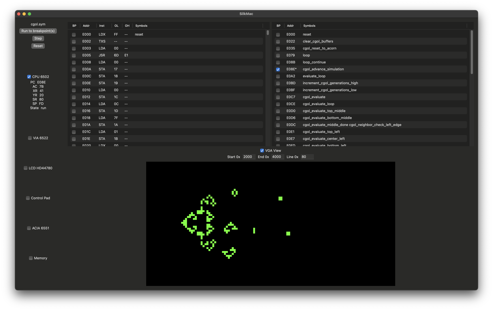

# silk-emu


[](https://github.com/mattstoker/silk-emu/actions/workflows/mac.yaml)
[](https://github.com/mattstoker/silk-emu/actions/workflows/windows.yaml)
[](https://github.com/mattstoker/silk-emu/actions/workflows/linux.yaml)

## Description

The Silk Emulator project provides libraries, command line programs, and GUI programs for emulation of 6502 microprocessor-based systems.
It also provides emulation for the following devices and assembly of those devices into systems using memory-mapped activation:

* W65C02 Microprocessor ([Datasheet](https://www.westerndesigncenter.com/wdc/documentation/w65c02s.pdf))
* W65C22 Versatile Interface Adapter ([Datasheet](https://www.westerndesigncenter.com/wdc/documentation/w65c22.pdf))
* W65C51 Asynchronous Communications Interface Adapter ([Datasheet](https://www.westerndesigncenter.com/wdc/documentation/w65c51n.pdf))
* HD44780U Liquid Crystal Display Controller ([Datasheet](https://cdn-shop.adafruit.com/datasheets/HD44780.pdf))
* AT28C64B Erasable Programmable Read-Only Memory ([Datasheet](https://ww1.microchip.com/downloads/en/DeviceDoc/doc0270.pdf))
* HM62256 Random Access Memory ([Datasheet](https://web.mit.edu/6.115/www/document/62256.pdf]))

A bread-board based hardware implementation of this system is excellently presented by Ben Eater at [eater.net/6502](https://eater.net/6502).

## Running silk-emu CLI from Binary Release (macOS, Windows, Linux)

* Download and decompress the package from [releases](https://github.com/mattstoker/silk-emu/releases) for your OS (Windows, macOS, Linux)
* Run `silk-emu` from a command line interface, which should provide details on using the program
* Your platform may require installation of the Swift runtime from [swift.org](https://swift.org)
* Also see the Sample Software section below (replace `swift run silk-emu` with `./silk-emu`)

## Building & Running silk-emu CLI from Source (macOS, Windows, Linux)
* Download and install Swift from [swift.org](https://swift.org)
* Run a command line shell and execute:

```
git clone https://github.com/mattstoker/silk-emu.git
cd silk-emu
swift run
```

## Building & Running macOS GUI
* Download and install Xcode from [developer.apple.com](https://developer.apple.com/xcode/)
* Run a command line shell and execute:

```
git clone https://github.com/mattstoker/silk-emu.git
cd silk-emu
open GUI/SilkMac/SilkMac.xcodeproj
```

## Sample 6502 Software

The emulator (source or binary release) includes sample software written in 6502 assembly in the ROM directory:

* hello.s - A hello-world style program that prints to the LCD
  - `swift run silk-emu ROM/hello.bin --print-lcd`
* serial.s - A serial read/echo program that receives input and re-transmits it
  - `swift run silk-emu ROM/serial.bin --acia-receive-file /dev/stdin --acia-transmit-file /dev/stdout`
* cgol.s - A simulation of Conway's Game of Life that can be viewed via screenshot or VGA
  - `swift run silk-emu ROM/cgol.bin --screenshot-frequency 1000000 --screenshot-start-address 8192 --screenshot-end-address 16383`
* jamantaos.s - An operating system style program for LCD, Serial, and VGA interfacing
  - Use one of the GUIs to run this and interact with button pad for control
